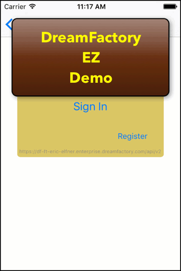

## DreamFactoryEZ

## Notes: 2017-11-16

* The DreamFactory Admin Panel **HAS SOME ISSUES WITH SAFARI BROWSER - DISTURBING!**.
* In response to a comment about this code I created a while back, I went ahead and created a new demo server
app at dreamfactory.com and update this project with that API Key and access URL.
* Updated for Swift 4, Xcode9, iPhoneX

### Overview

This project is primarily a rewrite of the [iOS Sample app](https://github.com/dreamfactorysoftware/ios-swift-sdk) 
for DreamFactory. While that app has some nice features, it is outdated and not complete, and 
seems to have some issues. It also does not seem very standard. 
This replacement uses the same demo backend and requires the same setup at that one.
[See Instructions](https://github.com/dreamfactorysoftware/ios-swift-sdk). 
I have committed this code with the API keys for my dev DreamFactory backend, so this may work out-of-the-box.
But be warned that with my API key exposed, that data is up from grabs and I'll take it down
once I see or hear of any abuse.

### Features
 
 - Generic REST client: This project has a somewhat generic RESTClient only customized
 for DreamFactory specifics where needed.
 - A DataAccess layer that knows about the domain data and has an interface for the needed
 application features.
 - Demonstration of simplified REST call chaining. Deleting a contact results in 3 async
 calls to the server, but this is all hidden within the RESTClient layer.
 - Automatic re-authentication of expired token.
 - Does not use any 3rd party libraries like AlamoFire or SwiftyJSON. I like an use those
 libraries, but wanted to show that they are not required and follow the minimalistic model
 of the existing demo app.
 - Error handling for all API errors.
 

### Setup Note

 - The DataAccess.swift file has the credentials for running this App via my personal demo
 DreamFactor account. It appears that they occasionally delete these, perhaps after a period
 of unusage. If the app does not run out-of-the-box you may need to setup your own server,
 or just ping me and I can setup a new one. 

### Changes from DreamFactory demo
  
 - Display, flow, presentation completely changed.
 - Internal design somewhat similar, but more clear boundaries between UI, App, and Server
 logic.
 - Updated for Swift 4 and all deprecated methods removed.
  
### Possible Enhancements

 - Implement the contact image upload features.
 - Add client side validation.
 - Advanced user registration with both email and OAuth providers (Facebook, Twitter) would
 be great.
 - Would really like to update the Sample. Improve the naming in the data model for starters.
 Then let those changes trickle down to the domain objects in the code and subsequent method
names. **Detail** for example might better be named **Address**.
 
 Let me know what you think mailto:eje@geoderanch.com

### Footnote on DreamFactory

I found DreamFactory while search for, well something just like it. From the [web](https://www.dreamfactory.com/features):

> Instant API creation
> 
> Hook up any SQL or NoSQL database, file storage system, or external service and 
> DreamFactory instantly generates a flexible, comprehensive, and fully documented 
> REST API endpoint that’s ready to use.

I have big plans for DreamFactory. Installing on my VPS was initially a bit of a pain, but
was completely straight forward once I used a plesk installed PHP 5.6 rather than updating
the Centos Server version from PHP 5.4 to 5.6 (I probably mucked that up even though it
seemed to be working). Also, there are Bitnami installers for DreamFactory that I'm 
sure would be more trouble free, I just wanted to know that I could do the install directly.

It seems that the user community is very active and the product has good support.
I am a bit **shocked** at the implementation of the iOS app sample app, thus, I have created this
project. The samples do not do the DreamFactory service justice. You should check it out:
[DreamFactory](https://www.dreamfactory.com)

Thanks for looking, Eric
